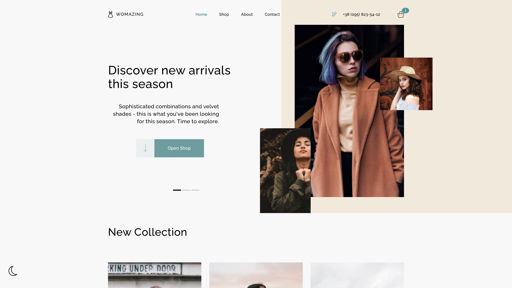

# Womazing – Responsive Vanilla JS E-Commerce Frontend

A fully responsive, multi-page e-commerce frontend built from scratch using HTML5, SCSS (BEM methodology), and modular Vanilla JavaScript. No frameworks or external UI libraries were used.

**Live Demo:** [https://kwuffa.github.io/Womazing/Home_page.html](https://kwuffa.github.io/Womazing/Home_page.html)

---

## 📖 Table of Contents

- [About the Project](#-about-the-project)
- [Features](#-features)
- [Tech Stack](#-tech-stack)
- [Architecture & State Management](#-architecture--state-management)
- [Responsive Design Strategy](#-responsive-design-strategy)
- [Local Setup](#-local-setup)
- [What I Learned](#-what-i-learned)
- [Kurzprofil für Recruiter (DE)](#-kurzprofil-für-recruiter-de)
- [Contact](#-contact)

---

## 🛍 About the Project

**Womazing** is a simulated high-quality women's clothing boutique. The brand focuses on unprecedented quality, zero-waste production, and making every girl feel unique.

Originally developed as a final capstone project for a front-end development course, I recently revived and completely refactored this application as part of my continuous self-study (Weiterbildung) for a **Fachinformatiker für Anwendungsentwicklung** apprenticeship. 

I translated the interface to English, modernized the responsive CSS architecture, resolved legacy layout bugs, and implemented strict form validation. The primary goal of this portfolio piece is to demonstrate a deep, hands-on understanding of core web technologies (DOM manipulation, Web Storage API, modular SCSS) before moving on to modern frameworks like React or Angular.

### Screenshots

<details>
<summary><b>Show Desktop View</b></summary>

</details>

<details>
<summary><b>Show Mobile View</b></summary>

</details>

---

## ✨ Features

| Feature | Description |
|---|---|
| **Multi-Page Architecture** | A complete 12-page application including Home, Shop catalog, individual Product pages, Cart, Checkout, Privacy Policy, Public Offer, Contact, and Success states. |
| **Shopping Cart Logic** | Add/remove items, quantity control, and state persistence using `sessionStorage` across multiple HTML pages. |
| **Dark/Light Mode** | System-wide theme toggling with smooth CSS transitions. |
| **Dynamic Filtering** | Interactive tab system on the Shop page to filter clothing categories. |
| **Form Validation** | Custom Vanilla JS form validation supporting international address formats and regex-based email/phone checks. |
| **Custom Animations** | CSS keyframe animations for page loading (rotating loader), UI notifications (success/error toasts), and interactive elements. |
| **Tabular-Nums** | Price calculation sections use `font-variant-numeric: tabular-nums` to prevent UI layout shifts during dynamic price updates. |

---

## 🛠 Tech Stack

| Technology | Purpose |
|---|---|
| **HTML5** | Multi-page architecture (MPA) with semantic markup. |
| **SCSS (Sass)** | Modular styling architecture. Used `Live Sass Compiler` for compilation. |
| **Vanilla JS (ES6+)** | All interactivity, DOM manipulation, form validation, and state management. |
| **SessionStorage API** | Maintaining the shopping cart state and theme preference during page routing. |
| **GitHub Pages** | Static site hosting and deployment. |

*Note: The project runs purely on native browser APIs with **zero runtime dependencies**.*

---

## 🏗 Architecture & State Management

### SCSS Modular Structure

The styling follows a scalable component-based architecture to avoid CSS specificity conflicts.

- `_reset.scss`: Cross-browser normalization.
- `styles.scss`: Global typography, variables, themes, and `rem`-based fluid font scaling.
- Component partials: `_header.scss`, `_footer.scss`, `_main_item.scss`, etc.

### JavaScript Organization

Logic is separated into highly specific scripts to keep the global scope clean:

- `addToCart.js`, `shoppingCart.js` & `countItemsInCart.js`: Cart DOM generation, math calculations, and SessionStorage synchronization.
- `form_validation.js` & `inputCountValidation.js`: Reusable form logic, regex pattern matching, and strict input control.
- `shopPageSelectCategory.js`: Dynamic category filtering logic for the catalog.
- `theme.js`: Dark mode state management.
- `tabs.js`, `gallery.js`, `carousel.js` & `call_appearance.js`: Modular UI interactions, modal windows, and event listeners.
- `scroll_header.js` & `menuHide.js`: Responsive navigation and scroll-based UI adaptations.

---

## 📱 Responsive Design Strategy

A rigorous **Desktop-First approach** was used, transitioning cleanly into a single-column layout on smaller devices. Scaling is managed globally via the `<html>` root font size (`rem` units).

| Breakpoint | Target Viewport | Behavior |
|---|---|---|
| **> 1920px** | Large Monitors | Max-width constraints prevent infinite stretching. Base `font-size: 16px` (up to 18px on 4K). |
| **1280px** | Small Laptops / Nest Hub | Fluid scaling via global `rem` reduction. |
| **991px** | Tablets / iPad Portrait | **Main breakpoint:** Grid collapses into a single-column layout. Hamburger menu activates. Base font size temporarily jumps to `16px` to fill the screen space comfortably. |
| **< 768px** | Mobile Phones | Touch-friendly spacing, scaled-down typography, horizontal scroll prevention. |

---

## ⚙️ Local Setup

Since this is a static multi-page application with compiled CSS, it can be run instantly without a Node.js server.

1. **Clone the repository:**

   ```bash
   git clone https://github.com/kwuffa/Womazing.git
   ```

2. **Open the project:**

   Simply open `Home_page.html` in any modern web browser.

   *(For the best development experience, use the "Live Server" extension in VS Code).*

3. **SCSS Compilation (Optional for development):**

   If you want to edit styles, install the `Live Sass Compiler` (by Glenn Marks) in VS Code, open `styles.scss`, and click "Watch Sass" in the status bar.

---

## 🧠 What I Learned

Building this project from scratch without frameworks taught me crucial lessons about web engineering:

1. **CSS Specificity and Architecture:** I learned how easily CSS classes can conflict across pages (e.g., pagination vs. item sizes) and how crucial naming conventions and modular SCSS files are for maintainability.
2. **Responsive Mathematics:** I mastered using `rem` units tied to a dynamically changing root `font-size` via media queries, allowing the entire application to scale proportionately across viewports without rewriting individual element sizes.
3. **State Management:** Storing and retrieving complex cart logic via `sessionStorage` and synchronizing it across a multi-page HTML architecture without a single-page app (SPA) router like React Router.
4. **Preventing Layout Shifts:** Resolving the "jumping text" issue during dynamic price calculations taught me about browser rendering behavior and the importance of bounding boxes and `tabular-nums` for dynamic numeric UI elements.

---

## 🇩🇪 Kurzprofil für Recruiter (DE)

Dieses Projekt wurde speziell entwickelt, um meine fundierten Kenntnisse in den Kerntechnologien der Webentwicklung (HTML, CSS/SCSS, Vanilla JavaScript) zu demonstrieren. Bevor ich mich komplexen Frameworks wie React oder Angular widme, war es mir wichtig, die Grundlagen (DOM-Manipulation, State Management via Web Storage API, und responsive CSS-Architektur ohne Bootstrap) tiefgreifend zu verstehen.

Das Projekt zeigt meine Fähigkeit, strukturierten und wartbaren Code zu schreiben, Bugs systematisch zu beheben (wie Layout-Shifts oder CSS-Konflikte) und eine performante, responsive Benutzeroberfläche zu entwickeln.

---

## 📬 Contact

- **GitHub:** [@kwuffa](https://github.com/kwuffa)
- **Email:** [mirevg06@gmail.com](mailto:mirevg06@gmail.com)